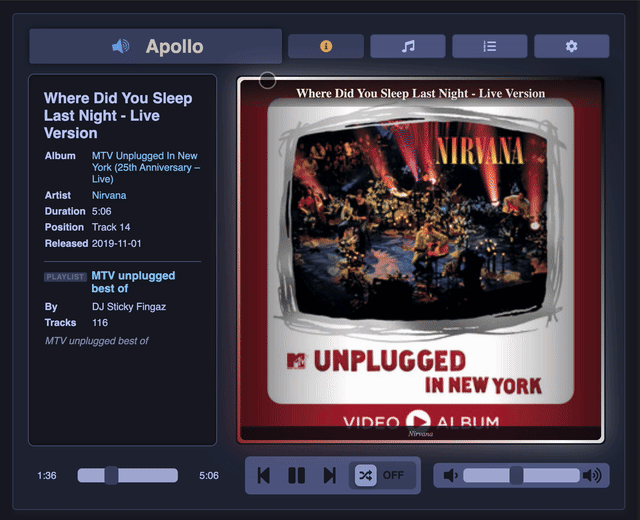
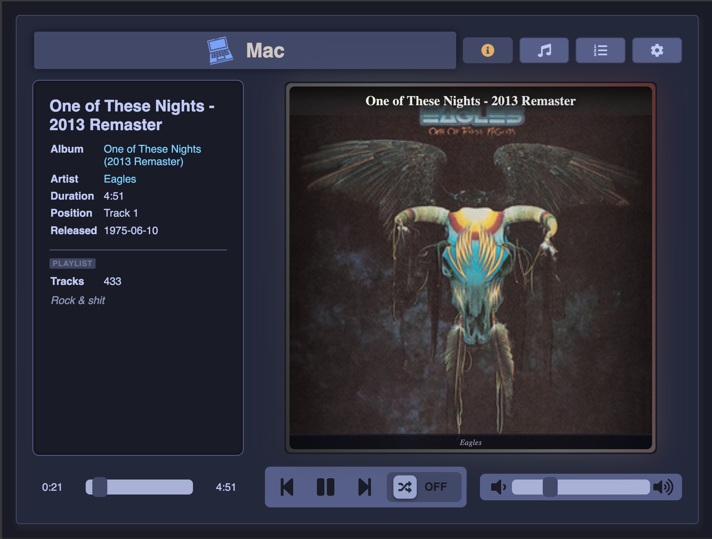
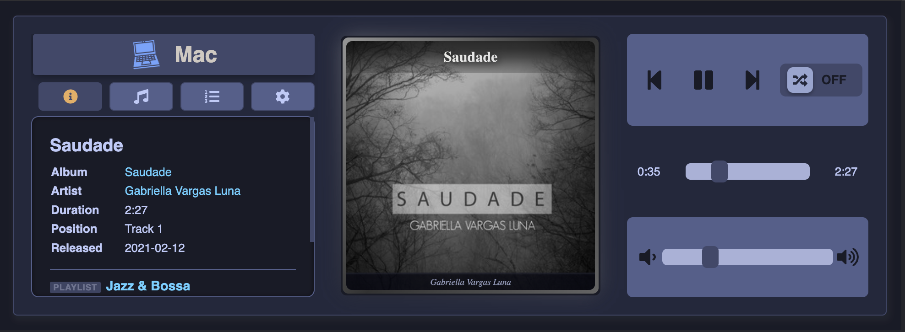
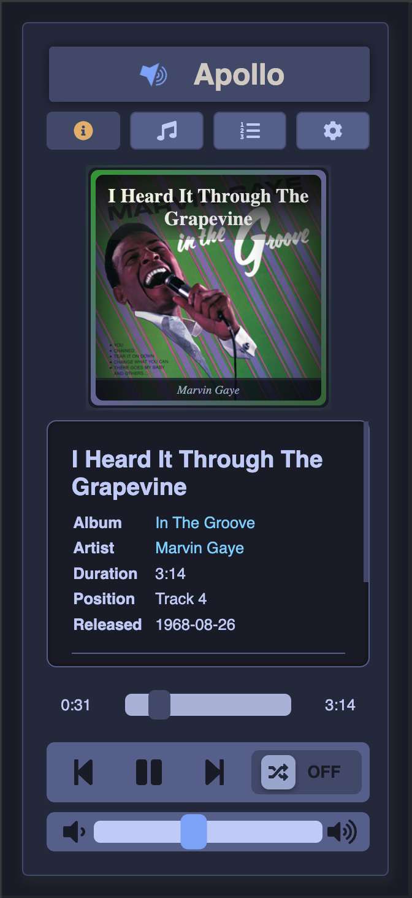
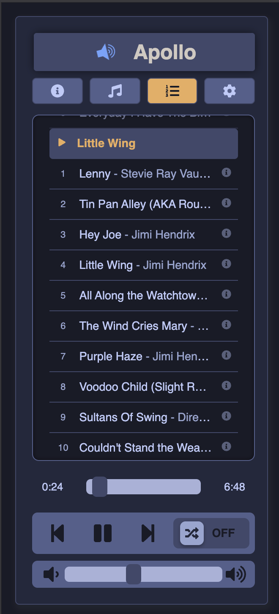
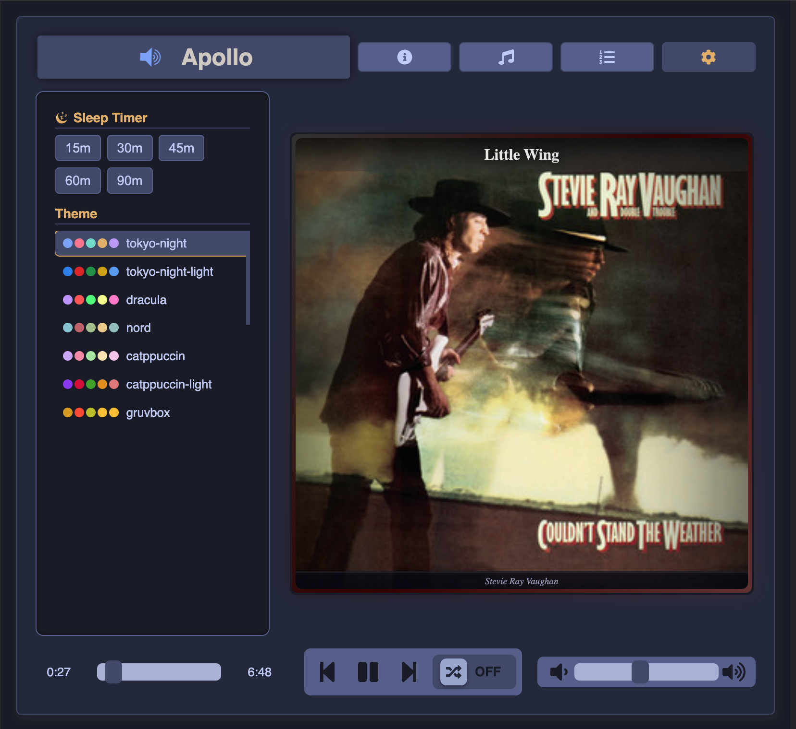
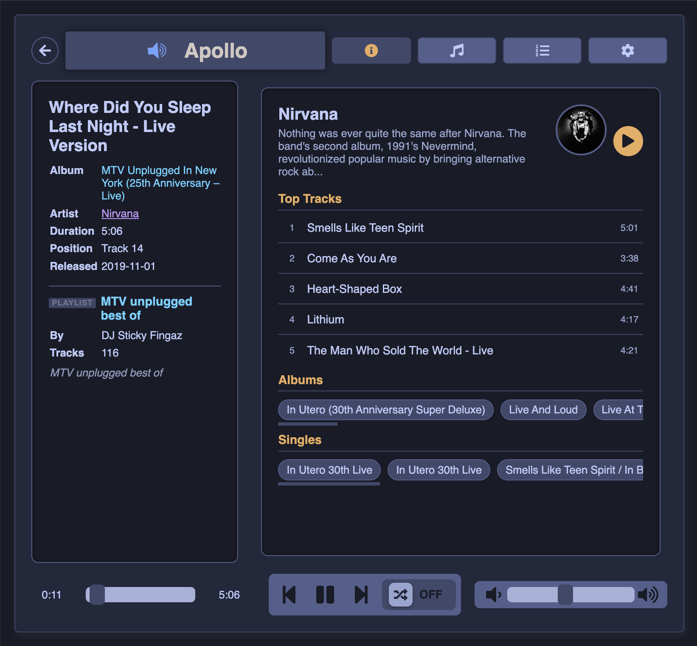

# react-librespot-controller
[](https://www.npmjs.com/package/@stronk-tech/react-librespot-controller)
[](https://www.npmjs.com/package/@stronk-tech/react-librespot-controller)
[](https://www.npmjs.com/package/@stronk-tech/react-librespot-controller)
[](https://www.npmjs.com/package/@stronk-tech/react-librespot-controller)
[](https://github.com/stronk-dev/react-librespot-controller/blob/master/LICENSE)
[](https://github.com/stronk-dev/react-librespot-controller/actions/workflows/dependabot/dependabot-updates)

A squeezebox-alike React frontend for controlling [`go-librespot`](https://github.com/devgianlu/go-librespot).

Use it as:
- a standalone page for touchscreens
- an embedded component in internal dashboards

## UI Scope
- Layout modes: `auto`, `default`, `widescreen`, `portrait`
- Views: `Info`, `Playlists`, `Queue`, `Settings`
- Interactive album art card: tap to browse the current album, playlist, or show
- In-app navigation from now playing metadata to album, artist, and show details
- Browse playlists: view tracks with lazy-loaded metadata, play individual tracks
- Browse artists: portrait image, biography, top tracks, albums, singles, related artists
- Browse albums: tracklist with durations, explicit badges, clickable artist links
- Browse shows: episodes with durations and publish dates
- Playlist cards with cover art, name, description, owner, track count
- Paginated playlist loading with infinite scroll
- Client-side image URL normalization for Spotify CDN compatibility
- Comes with a set of preset themes and sleep timer
- Podcast controls include skip back 15s and skip forward 30s

## Backend Requirements
This UI needs a [`go-librespot`](https://github.com/devgianlu/go-librespot) instance with:
- HTTP API: player controls, metadata endpoints (`/metadata/rootlist`, `/metadata/playlist/{id}`, `/metadata/track/{id}`, `/metadata/album/{id}`, `/metadata/artist/{id}`, `/metadata/show/{id}`, `/metadata/episode/{id}`)
- WebSocket event stream at `/events`
- All metadata is fetched via Spotify's native Mercury/protobuf protocols (no Spotify Web API keys needed)

## Standalone Setup
Create a `.env` file:

```env
REACT_APP_API_BASE_URL=http://apollo:3678
REACT_APP_WS_URL=ws://apollo:3678/events
REACT_APP_KIOSK_MODE=false
REACT_APP_HIDE_ON_DISCONNECT=false
REACT_APP_LAYOUT=auto
```

Install and run:

```bash
npm install
npm run test
npm run static
npm run build
```

Commands:
- `npm run test`: starts the local demo app
- `npm run static`: creates the static app build
- `npm run build`: builds the npm package output in `dist/`

## Module Setup
Install:

```bash
npm install --save @stronk-tech/react-librespot-controller
```

Use:

```jsx
import MediaPlayer from "@stronk-tech/react-librespot-controller";

<MediaPlayer
  websocketUrl="ws://apollo:3678/events"
  apiBaseUrl="http://apollo:3678"
  hideOnDisconnect={false}
  kioskMode={false}
  layout="auto"
  maxHeight="70vh"
  mobileBreakpoint={768}
  theme="tokyo-night"
/>;
```

### Embedding

The player sizes itself automatically via CSS `aspect-ratio`. Height is derived from available width per layout mode — tab content scrolls internally and never resizes the outer card.

```jsx
<div style={{ width: "100%", overflow: "hidden" }}>
  <MediaPlayer websocketUrl="ws://apollo:3678/events" apiBaseUrl="http://apollo:3678" />
</div>
```

Override the max-height cap or panel scroll height with CSS vars:

```css
.my-wrapper {
  --spotify-player-max-height: 70vh;
  --spotify-player-panel-max-height: 48vh;
}
```

### Props
- `websocketUrl`: WebSocket URL for `go-librespot` events
- `apiBaseUrl`: HTTP API base URL for `go-librespot`
- `hideOnDisconnect`: hides the component when API connection is down
- `kioskMode`: uses full-screen behavior
- `autoDetectKiosk`: auto-enables kiosk mode when card fills most of viewport (default `false`)
- `layout`: `auto`, `default`, `widescreen`, `portrait`
- `maxHeight`: maximum component height cap (CSS value, default `100vh`)
- `panelMaxHeight`: maximum height for scrollable content panels like playlists/details (default `60vh`)
- `mobileBreakpoint`: when `layout="auto"`, force portrait at or below this viewport width (default `768`)
- `theme`: optional preset name; if omitted, saved theme is used, default is `tokyo-night`

### Theme Presets
`tokyo-night`, `tokyo-night-light`, `dracula`, `nord`, `catppuccin`, `catppuccin-light`, `gruvbox`, `gruvbox-light`, `one-dark`, `github-dark`, `rose-pine`, `solarized`, `solarized-light`, `ayu-mirage`

### Preview


### Default view / Kiosk mode


### Widescreen


### Portrait


### Queue


### Settings


### Browse

